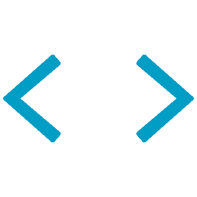
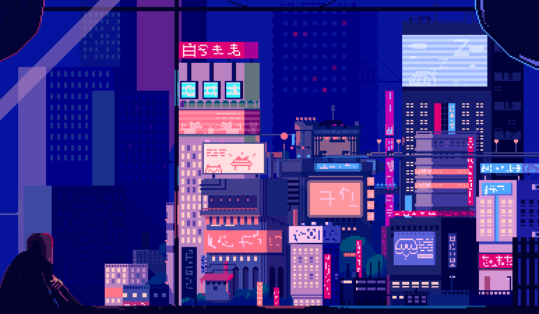
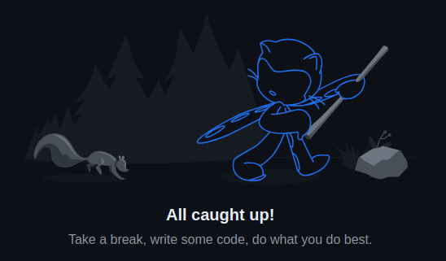

<!-------------------------------- Header -------------------------------->

 

    
    
    
    
    

<!-------------------------------- End of Header -------------------------------->

<!-------------------------------- Intro -------------------------------->

# Hi, My fellow <𝚌𝚘𝚍𝚎𝚛 />! 

### A self-taught passionate backend developer from India 🇮🇳

-   🔭 I’m currently working in [**Instance IT Solutions**](https://www.instanceit.com)

-   🌱 I’m currently learning **Backend Development**

-   👯 I’m looking to collaborate on **Open Source Projects**

-   💬 Ask me about **Javascript, NodeJS, MongoDB, Python**

-   📫 How to reach me **harshdobariya1234+github@gmail.com**

<!-------------------------------- End of Intro -------------------------------->

<!-------------------------------- Contact -------------------------------->

##  Contact Me

##  Coding Handles

<!-- Todo: Add NPM Package For Email -->

<!-------------------------------- End of Contact -------------------------------->

<!-------------------------------- Skills -------------------------------->

<h3 align="center">
    
    【 S K I L L S 】
    
</h3>

### 👨‍💻 Programming and Markup Languages

    
    
    
    
    
    
    

### 🧰 Frameworks and Libraries

    
    

### 🗄️ Databases

    
    
    

### ☁️ Cloud Hosting

    
    
    

### 💻 Software and Tools

    
    
    
    
    
    
    
    
    

<!-- Todo: Give QR Code For Linkedin Profile Skills -->

<!-------------------------------- End of Skills -------------------------------->

<!-------------------------------- Stats -------------------------------->

<h3 align="center">
    
    【 S T A T S 】
    
</h3>

###  Coding Stats

<!-- Todo: Add Conding Profile Stats -->

###  GitHub Stats

    

###  GitHub Graph

    

### GitHub Trophy

    

<!-- Todo: Add 3D Graph -->

<!-------------------------------- End of Stats -------------------------------->

<!-------------------------------- My Repos -------------------------------->

<h3 align="center">
    
    【 M Y_R E P O S I T O R I E S 】
    
</h3>

    
    
    
    
    
    

<!-------------------------------- End of My Repos -------------------------------->

<!-------------------------------- Quotes -------------------------------->

<h3 align="center">
    
    【 Q U O T E S 】
    
</h3>

     
    <a href="https://github.com/harsh-dobariya" target="_blank">
        
          
        
    </a>

 

    

    <a href="https://github.com/harsh-dobariya">
        <picture>
            <source media="(prefers-color-scheme: dark)" srcset="https://raw.githubusercontent.com/Harsh-Dobariya/Harsh-Dobariya/contribution/contribution_snake_grid_darkBlue.svg">
            <source media="(prefers-color-scheme: light)" srcset="https://raw.githubusercontent.com/Harsh-Dobariya/Harsh-Dobariya/contribution/contribution_snake_grid.svg">
            
        </picture>
    </a>

<!-------------------------------- End of Quotes -------------------------------->

<!-------------------------------- Thanks -------------------------------->

     
    <a href="https://github.com/harsh-dobariya" target="_blank">
        
          
        
    </a>

<!-------------------------------- End of Thanks -------------------------------->
