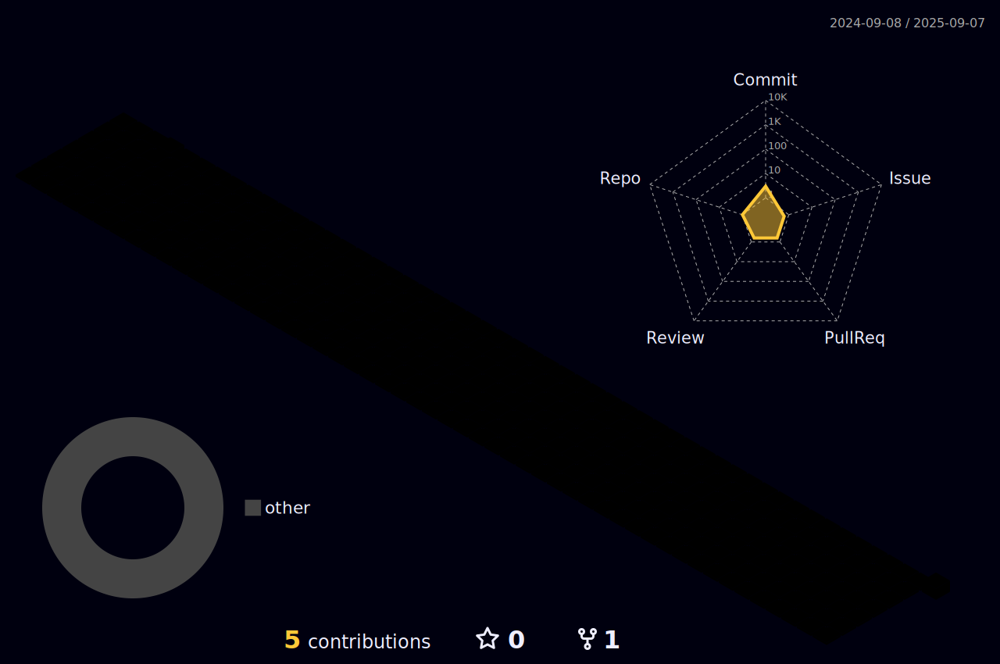
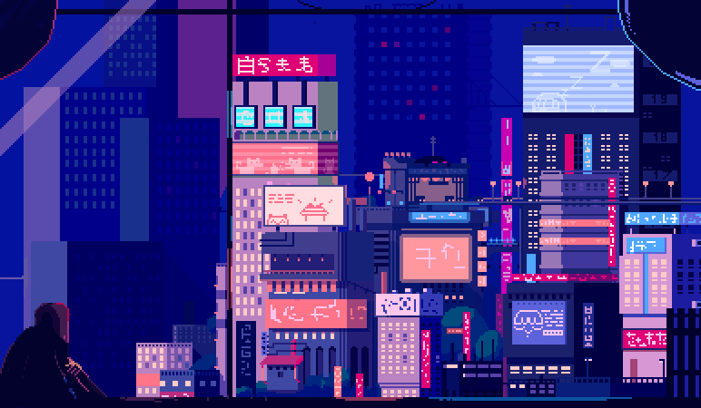

<!-------------------------------- Header Section -------------------------------->

 

<!-- Status Badges -->

  
  
  
  
  

<!-------------------------------- Introduction Section -------------------------------->

# Hi, My fellow <𝚌𝚘𝚍𝚎𝚛 />! 

### A self-taught passionate backend developer from India 🇮🇳

-   🔭 I'm currently working in [**Instance IT Solutions**](https://www.instanceit.com)
-   🌱 I'm currently learning **Backend Development**
-   👯 I'm looking to collaborate on **Open Source Projects**
-   💬 Ask me about **Javascript, NodeJS, MongoDB, Python**
-   📫 How to reach me **harshdobariya1234+github@gmail.com**

<!-------------------------------- Contact Information -------------------------------->

##  Contact Me

  
  
  
  

##  Coding Handles

  
  
  
  

<!-------------------------------- Skills Section -------------------------------->

<h3 align="center">
  
  【 S K I L L S 】
  
</h3>

### 👨‍💻 Programming and Markup Languages

  
  

### 🧰 Frameworks and Libraries

  
  
  

### 🗄️ Databases

  
  
  

### ☁️ Cloud Hosting

  
  
  

### 💻 Software and Tools

  
  
  
  
  
  
  

<!-------------------------------- Statistics Section -------------------------------->

<h3 align="center">
  
  【 S T A T S 】
  
</h3>

###  Coding Stats

  <table>
    <tr>
      <td>
        
      </td>
      <td>
        
      </td>
    </tr>
  </table>

###  GitHub Stats

  

###  GitHub Graph

  <a href="https://github.com/harsh-dobariya" target="_blank">
    
    
    
    
    
      
    
  </a>

###  GitHub Trophy

  

<!-------------------------------- Repository Showcase -------------------------------->

<h3 align="center">
  
  【 M Y _ R E P O S I T O R I E S 】
  
</h3>

  
  
  
  
  
  

<!-------------------------------- Quotes & Closing -------------------------------->

<h3 align="center">
  
  【 Q U O T E S 】
  
</h3>

   
  <a href="https://github.com/harsh-dobariya" target="_blank">
    
      
    
  </a>

 

<!-- Snake Animation Section -->

  

  <a href="https://github.com/harsh-dobariya">
    <picture>
      <source media="(prefers-color-scheme: dark)" srcset="https://raw.githubusercontent.com/Harsh-Dobariya/Harsh-Dobariya/contribution/contribution_snake_grid_darkBlue.svg">
      <source media="(prefers-color-scheme: light)" srcset="https://raw.githubusercontent.com/Harsh-Dobariya/Harsh-Dobariya/contribution/contribution_snake_grid.svg">
      
    </picture>
  </a>

<!-------------------------------- Thank You Section -------------------------------->

   
  <a href="https://github.com/harsh-dobariya" target="_blank">
    
      
    
  </a>

<!-------------------------------- Footer -------------------------------->
